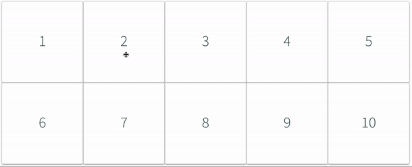
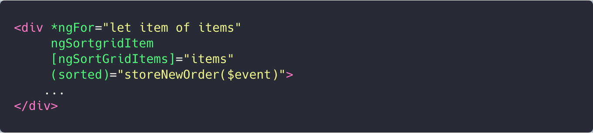

# Getting started
## Download the module

```
npm i -s ng-sortgrid
```

Import the ```NgsgModule``` in your ```AppModule```.

```
  ...
  imports: [BrowserModule, NgsgModule],
  ...
```

## 1. Apply the directive
Loop over your elements with *ngFor. 🛎️ the items needs to be an array.


Apply the ngSortgridItem directive


## 2. React on changes
In most cases you are interested in the new sort order. Often you want to store them in local storage or even send them to the backend. To do so the following two steps are needed in addition to the "Getting started" step.

Pass your items to the directive via the ngSortGridItems input.


React on the 'sorted' output events



## 3. Group sortgrids
In case you have more than one sortgriditem on the page you need to group the sortgriditems to avoid dropping drags from one group in another group.
Pass in a unique name to the ngSortGridGroup input


